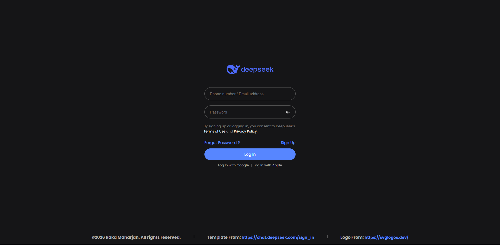
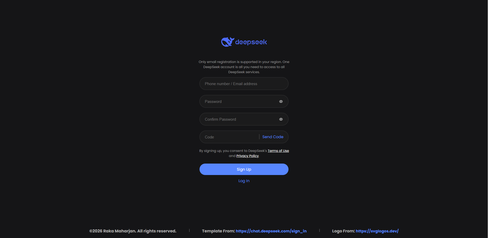

# SumBull 🚀


A polished front-end landing page project built with HTML, CSS, and Vite. SumBull presents a clean sign-in interface with modern styling and a lightweight development setup.

## ✨ Overview

This project focuses on creating a visually appealing authentication page with a responsive layout, custom styling, and a smooth local development experience using Vite.

## 📸 Preview

Sign-In Page


Sign-Up Page


## 🌟 Features

- 🖼️ Clean and modern UI design
- 🔐 Styled sign-in form with password field
- 🎨 Modular CSS structure for easy customization
- ⚡ Fast local development with Vite
- 📱 Responsive layout for different screen sizes

## 🛠️ Tech Stack

- 🌐 HTML5
- 🎨 CSS3
- ⚡ Vite
- 🖼️ SVG-based assets

## ▶️ Run Locally

1. Install dependencies:
   ```bash
   npm install
   ```

2. Start the development server:
   ```bash
   npm run dev
   ```

3. Open the local preview in your browser:
   ```text
   http://localhost:5173
   ```

## 📁 Project Structure

```text
SumBull/
├── index.html
├── package.json
├── CSS/
├── public/
└── src/
    └── assets/
```

## 🙏 Credits

- UI inspiration from the DeepSeek sign-in experience
- SVG assets sourced from public design resources

## 👨‍💻 Author

Raka Maharjan ( blackST4Rez )

## 📄 License

This project is licensed under the MIT License. See the LICENSE file for more details.

## 🤝 Support

If you like this project, please consider giving it a star ⭐. Your support means a lot and encourages further improvements.
